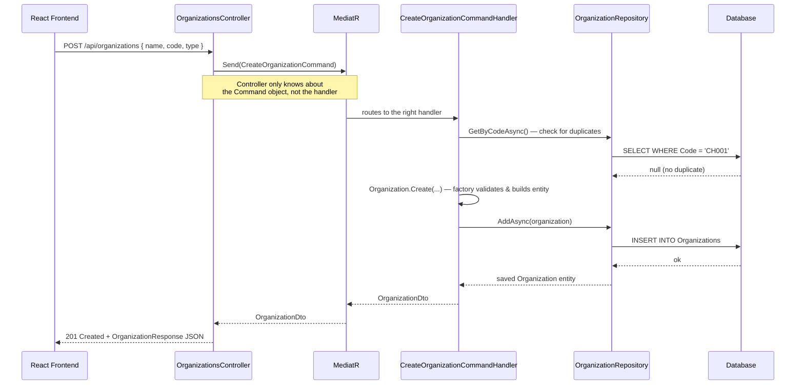
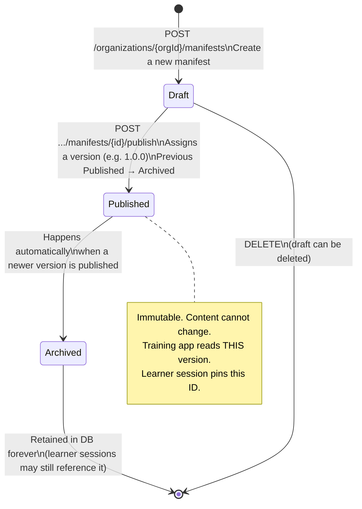

# System Architecture — Visual Guide

> Open this file in VS Code with the **Markdown Preview** pane (Cmd+Shift+V) to render the diagrams.

---

## 1. The Layers — What Lives Where

Think of the system as four concentric rings. The inner rings know nothing about the outer ones.

```
┌─────────────────────────────────────────────────────────┐
│  API  (LaerdalImplementation.Api)                       │
│  Controllers · Request/Response models · Middleware     │
│  "Translates HTTP into a message, then back again"      │
│                                                         │
│  ┌─────────────────────────────────────────────────┐   │
│  │  APPLICATION  (LaerdalImplementation.Application)│   │
│  │  Commands · Queries · Handlers · DTOs · Mappers │   │
│  │  "Orchestrates a use case end-to-end"           │   │
│  │                                                 │   │
│  │  ┌─────────────────────────────────────────┐   │   │
│  │  │  DOMAIN  (LaerdalImplementation.Domain) │   │   │
│  │  │  Organization · Manifest · Enums        │   │   │
│  │  │  Repository interfaces                  │   │   │
│  │  │  "The business rules. No dependencies." │   │   │
│  │  └─────────────────────────────────────────┘   │   │
│  └─────────────────────────────────────────────────┘   │
│                                                         │
│  INFRASTRUCTURE  (LaerdalImplementation.Infrastructure) │
│  EF Core DbContext · OrganizationRepository             │
│  ManifestRepository · Migrations                        │
│  "Talks to the database (SQLite locally,                │
│   SQL Server in production). Nothing else depends here."│
└─────────────────────────────────────────────────────────┘
```

**The key rule:** arrows only point inward. `OrganizationsController` knows about `Application`. `Application` knows about `Domain`. `Domain` knows about nothing. `Infrastructure` knows about `Domain` (to implement the interfaces), but `Domain` never knows about `Infrastructure`.

---

## 2. CQRS + MediatR — What Actually Happens on a Request

**CQRS** = Commands change data. Queries read data. They're kept separate.

**MediatR** = a library that acts as a message bus. The controller sends a message; MediatR finds the right handler without the controller needing to know which class that is.

**Analogy:** the controller is a hotel guest. MediatR is the front desk. The handler is the person who actually does the work. The guest never talks to the cleaner directly.

### Flow: `POST /api/organizations` → Creates an org in the DB



**Why the DTO layers?** The domain entity (`Organization.cs`) is for business logic. The DTO (`OrganizationDto`) is for moving data between layers. The response model (`OrganizationResponse`) is what the HTTP client sees. Keeping them separate means you can change the API response shape without touching domain rules.

---

## 3. Manifest Lifecycle — The State Machine

A manifest can only move forward. You can never un-publish.



**Why immutable?** A learner could be mid-session when an admin edits content. If the manifest could change in-place, the learner's content would shift under them. Instead, a new version is published, old one archived — the learner's session still points to the same ID they started with.

---

## 4. Auth — Who Can Do What

```
┌─────────────────────────────────────────────────────┐
│                     3 Callers                       │
│                                                     │
│  [React App]          [Hospital Admin]   [Training  │
│  (Laerdal staff)      (scoped to         App]       │
│                        own org only)                │
│       │                    │                │       │
│       └────────────────────┘                │       │
│            OIDC JWT token                   │       │
│            (role claim tells               │       │
│             what they can do)               │       │
│                                     Client Credentials│
│                                     OAuth2 token  │  │
│                                     scope: manifest:read│
│                                             │       │
└─────────────────────────────────────────────────────┘
                         │
                    [API]
                    checks role claim
                    on every request
```

| Caller | How they authenticate | What they can do |
|---|---|---|
| Laerdal staff | OIDC JWT, `role=laerdal_admin` | Everything across all orgs |
| Hospital admin | OIDC JWT, `role=org_admin` + `orgId` claim | Only their own org + children |
| Training app | OAuth2 client credentials (machine-to-machine) | Read published manifest for their org only |

---

## 5. The Uniqueness Rule — Why NULLs Matter

Organization codes must be unique **within the same parent**. So "HR-001" can exist under Hospital A and also under Hospital B — no conflict.

The database enforces this with a composite unique index on `(Code, ParentId)`.

**Gotcha:** SQL Server treats `NULL != NULL` in unique indexes. Two root organizations (no parent, `ParentId = NULL`) with the same code would slip past the DB constraint. The application-level check in `CreateOrganizationCommandHandler` catches this before the INSERT — and if two concurrent requests race past the check simultaneously, the DB rejects the second INSERT and we return `409 Conflict`.
